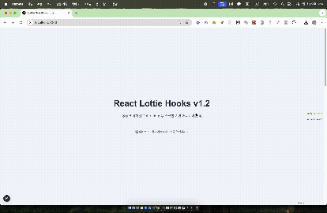

# 🎯 React DotLottie Hooks v1.2.7

**모던한 React 애플리케이션을 위한 간단하고 강력한 DotLottie 애니메이션 훅**

> ✨ DotLottie + GSAP ScrollTrigger로 멋진 스크롤 애니메이션을 쉽게 만들어보세요!
>
> **v1.2.7은 최신 안정 버전입니다** - 4가지 주요 React 프레임워크 완전 지원

## 📁 프로젝트 구조

```
pnpm-monorepo/
├── packages/
│   └── react-lottie-hooks/     # 🎯 메인 훅 라이브러리
└── examples/
    ├── nextjs-example/         # Next.js 예제
    ├── vite-example/           # Vite 예제
    ├── remix-example/          # Remix 예제
    └── react-router-example/   # React Router 예제
```

## 🚀 빠른 시작

### 1. 패키지 설치

```bash
# pnpm (권장)
pnpm add @jurneyx2/react-lottie-hooks @lottiefiles/dotlottie-react gsap

# npm
npm install @jurneyx2/react-lottie-hooks @lottiefiles/dotlottie-react gsap

# yarn
yarn add @jurneyx2/react-lottie-hooks @lottiefiles/dotlottie-react gsap
```

### 2. 기본 사용법

```tsx
import React from "react";
import { DotLottieReact } from "@lottiefiles/dotlottie-react";
import { useLottieScrollTrigger } from "@jurneyx2/react-lottie-hooks";

export default function MyComponent() {
  const { triggerRef, lottieContainerRef, handleDotLottieRef, isLoaded } =
    useLottieScrollTrigger({
      start: "top center",
      end: "bottom center",
      debug: process.env.NODE_ENV === "development",
    });

  return (
    <div>
      {/* 스크롤 트리거 영역 */}
      <div ref={triggerRef} style={{ height: "100vh" }}>
        <h2>스크롤하면 애니메이션이 시작됩니다!</h2>
      </div>

      {/* DotLottie 애니메이션 */}
      <div ref={lottieContainerRef}>
        <DotLottieReact
          src="/my-animation.lottie"
          loop={false}
          autoplay={false}
          dotLottieRefCallback={handleDotLottieRef}
        />
      </div>

      {isLoaded && <p>애니메이션 로드 완료! ✨</p>}
    </div>
  );
}
```

## 📦 패키지

### [@jurneyx2/react-lottie-hooks](./packages/react-lottie-hooks)

메인 훅 라이브러리입니다.

**주요 특징:**

- 🎨 **DotLottie 전용**: `@lottiefiles/dotlottie-react` 완벽 지원
- 📱 **SSR/CSR 안전**: Next.js, Nuxt.js 등 완벽 지원
- 🎯 **GSAP ScrollTrigger**: 스크롤 기반 애니메이션
- 🔧 **TypeScript**: 완전한 타입 안전성
- ⚡ **최적화**: 성능과 메모리 효율성

## 🎨 예제



### Next.js 예제

- 📁 [examples/nextjs-example](./examples/nextjs-example)
- 🌐 App Router 사용
- ✨ 기본 & 고급 애니메이션 데모
- 🎯 SSR 안전성 시연

**실행 방법:**

```bash
cd examples/nextjs-example
pnpm install
pnpm dev
# http://localhost:3000에서 확인
```

### Vite 예제

- 📁 [examples/vite-example](./examples/vite-example)
- ⚡ 빠른 개발 환경
- 🎨 Tailwind CSS 스타일링
- 🎯 다양한 사용 사례

**실행 방법:**

```bash
cd examples/vite-example
pnpm install
pnpm dev
# http://localhost:5173에서 확인
```

### Remix 예제

- 📁 [examples/remix-example](./examples/remix-example)
- 🏃 최신 Remix 프레임워크
- 🎨 Tailwind CSS 스타일링
- 🔄 SSR/CSR 안전성 시연

**실행 방법:**

```bash
cd examples/remix-example
pnpm install
pnpm dev
# http://localhost:5173에서 확인
```

### React Router 예제

- 📁 [examples/react-router-example](./examples/react-router-example)
- 🚦 최신 React Router 7
- 🎨 Tailwind CSS 4.0 스타일링
- 📂 파일 기반 라우팅

**실행 방법:**

```bash
cd examples/react-router-example
pnpm install
pnpm dev
# http://localhost:5173에서 확인
```

### 🎥 모든 예제 공통 기능


모든 예제에는 다음 기능들이 포함되어 있습니다:

- **🎬 스크롤 트리거 애니메이션**: 스크롤에 따른 부드러운 DotLottie 애니메이션
- **⏯️ 수동 재생/일시정지 컨트롤**: 애니메이션 수동 제어
- **🔍 실시간 디버그 정보**: 애니메이션 상태 실시간 표시
- **📱 반응형 디자인**: 모바일 친화적 레이아웃
- **⚡ 성능 모니터링**: 프레임률 및 상태 추적
- **🔄 모드 전환**: 스크롤/수동 제어 모드 토글

### 📸 스크린샷 갤러리

| 프레임워크       | 데스크톱 뷰                                                    | 모바일 뷰                                                    |
| ---------------- | -------------------------------------------------------------- | ------------------------------------------------------------ |
| **Next.js**      |        |        |
| **Vite**         |          |          |
| **Remix**        |         |         |
| **React Router** |  |  |

## 🛠️ 개발

### 요구사항

- Node.js 16+
- pnpm 8+

### 설치

```bash
git clone <repository-url>
cd pnpm-monorepo
pnpm install
```

### 빌드

```bash
# 전체 빌드
pnpm build

# 패키지만 빌드
pnpm build:packages

# 예제만 빌드
pnpm build:examples
```

### 개발 서버 실행

```bash
# 모든 예제 실행
pnpm dev

# 특정 예제만 실행
cd examples/nextjs-example
pnpm dev
```

## 🆚 v1.2.7 주요 특징 (최신 버전)

### ✨ 새로운 개선사항

- **🌍 완전한 다국어 지원**: 모든 디버그 메시지가 한국어/영어 지원
  ```tsx
  const hook = useLottieScrollTrigger({
    debug: true,
    debugLanguage: "en", // "ko" | "en"
  });
  ```
- **🔧 ES Module 호환성**: 모든 번들러(Vite, Webpack, esbuild)에서 안정적 동작
- **📦 모듈 해결 개선**: `gsap/ScrollTrigger` 경로로 표준화
- **🛠️ 개발자 경험**: 언어별 디버그 메시지로 더 나은 개발 경험

### ✅ 기존 버전 대비 개선된 점

- **단순화**: DotLottie 전용으로 API가 훨씬 간단해졌습니다
- **성능**: 단일 라이브러리 지원으로 번들 크기 감소
- **안정성**: 복잡한 하이브리드 로직 제거
- **타입 안전성**: DotLottie 전용 타입으로 더 정확함
- **프레임워크 지원**: Next.js, Vite, Remix, React Router 완전 지원

### 💔 Breaking Changes (v1.1.x에서)

- `mode` 옵션 제거 (DotLottie만 지원)
- `animationData`, `path`, `renderer` 등 lottie-web 옵션 제거
- `lottie-web` 의존성 완전 제거

자세한 마이그레이션 가이드는 [CHANGELOG.md](./packages/react-lottie-hooks/CHANGELOG.md)를 참조하세요.

## 📖 자세한 문서

- 📋 [API 문서](./packages/react-lottie-hooks/README.md)
- 📝 [변경 기록](./packages/react-lottie-hooks/CHANGELOG.md)
- 🎯 [예제 코드](./examples/)

## 🤝 기여하기

1. 이 저장소를 포크하세요
2. 기능 브랜치를 만드세요 (`git checkout -b feature/amazing-feature`)
3. 변경사항을 커밋하세요 (`git commit -m 'feat: add amazing feature'`)
4. 브랜치에 푸시하세요 (`git push origin feature/amazing-feature`)
5. Pull Request를 열어주세요

## 📄 라이선스

MIT License - 자세한 내용은 [LICENSE](LICENSE) 파일을 참조하세요.

## 🙏 감사의 말

- [@lottiefiles/dotlottie-react](https://github.com/LottieFiles/dotlottie-react) - 훌륭한 DotLottie React 컴포넌트
- [GSAP](https://greensock.com/gsap/) - 강력한 애니메이션 라이브러리
- React 커뮤니티의 모든 기여자들

---

**💡 궁금한 점이 있으시면 Issues에 남겨주세요!**

## 📚 참고 자료

- [블로그 글](https://velog.io/@younyikim/Pnpm%EC%9C%BC%EB%A1%9C-Monorepo-%EA%B5%AC%EC%B6%95%ED%95%98%EA%B8%B0-2.-%ED%94%84%EB%A1%9C%EC%A0%9D%ED%8A%B8-%EA%B5%AC%EC%B6%95Vite-React-TypeScript)
- [pnpm workspace 공식 문서](https://pnpm.io/workspaces)
- [모노레포 설정 가이드](https://github.com/pnpm/pnpm)
- [TypeScript 설정 가이드](https://www.typescriptlang.org/tsconfig)
